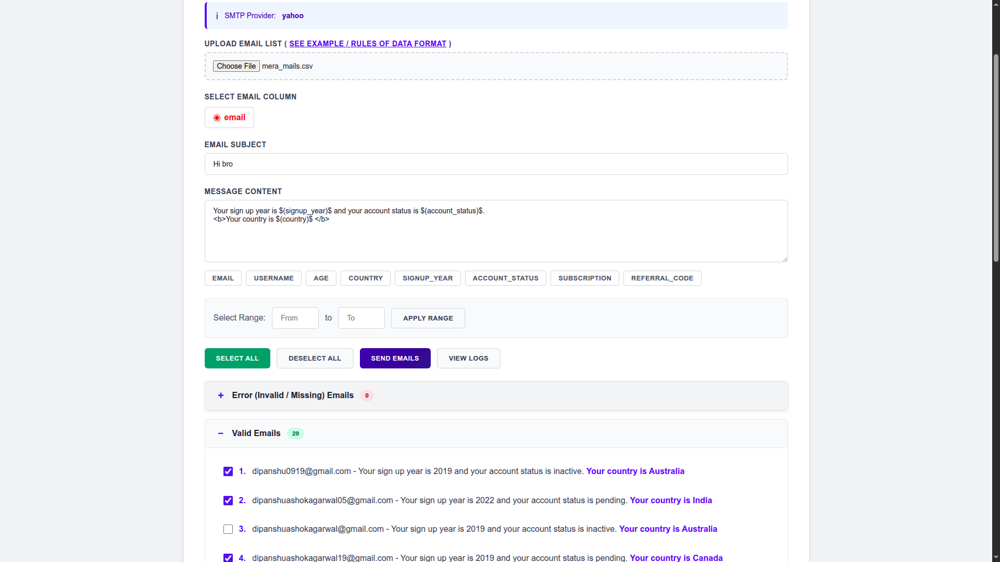
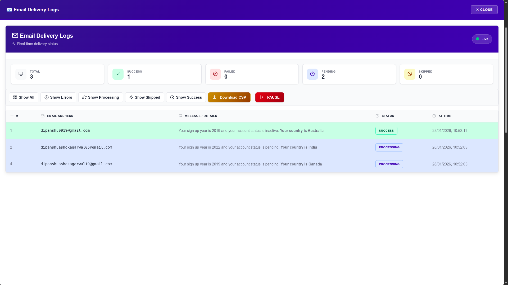
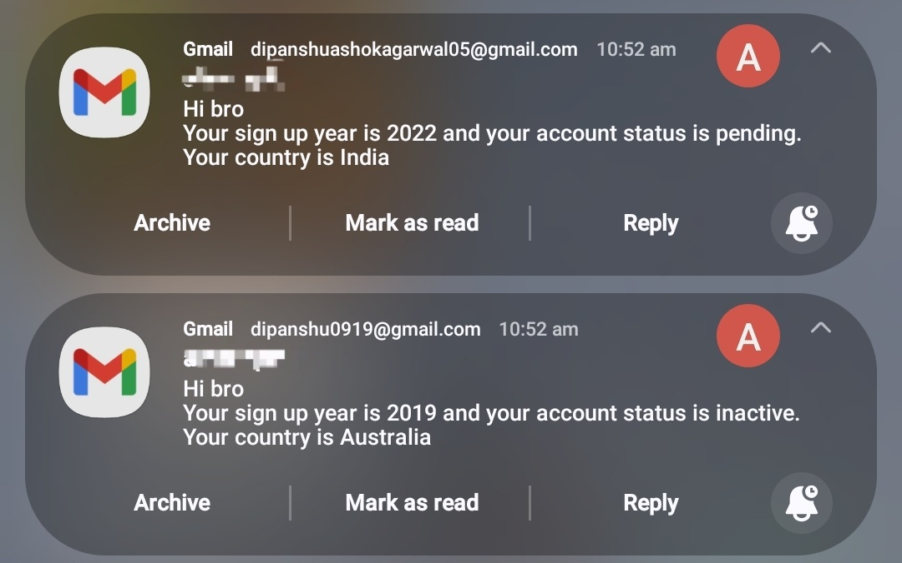

# MailSender

MailSender is a secure, local-hosted bulk email automation tool designed for sending personalized marketing campaigns, newsletters, and organizational updates. Unlike expensive cloud services, this runs entirely on your local machine, giving you full control over your data and sender reputation.

## 🌟 Why Use MailSender?

* **Cost-Effective:** Uses your existing SMTP credentials (Gmail, Outlook, Zoho, etc.) instead of charging per-email fees like Mailchimp or SendGrid.
* **100% Privacy:** **Runs entirely on your local machine.** Your customer lists and email data never leave your computer; they are processed locally and sent directly via your SMTP provider.
* **Hyper-Personalization:** Boost engagement by inserting dynamic data (e.g., Names, Departments, Salaries, IDs) directly into your email body using simple placeholders.
* **Safety First:** Automatically skips emails if required placeholder data is missing, preventing embarrassing "Hello $(Name)$" errors.

## 🎯 Who Is This For?

* **Digital Marketers:** Send cold emails or newsletters with personalized subject lines and content.
* **HR Professionals:** Distribute payslips, policy updates, or interview schedules to employees securely.
* **Small Business Owners:** Manage client updates and invoices without monthly subscription costs.
* **Event Organizers:** Send personalized tickets, invites, or reminders to attendee lists.
* **Developers/Students:** Learn how to implement background threading and SMTP protocols in Python.

## 🚀 Key Features

* **Local Execution:** Launches a local web server (`http://127.0.0.1:8026`) accessible only to you.
* **Multi-Format Support:** Upload contact lists via **Excel (.xlsx)**, **CSV**, or **JSON**.
* **Smart Provider Detection:** Automatically configures SMTP settings for Gmail, Yahoo, Zoho, and Office365 based on your email address.
* **Live Control Room:**
    * **Real-time Logs:** Watch success, failure, and skip statuses update instantly.
    * **Pause & Resume:** Need to check something? Pause the campaign and resume exactly where you left off.
* **Dark/Light Mode:** Comfortable UI for day or night work.

## 📷 Images
  **Home Page**
  
  
  **Email Selection and Sending Dynamic Message**
  
  
  **Dynamic Logs Page**
  
  
  **Email Received as formmated**
  
  
## 🛠️ Installation & Setup

1.  **Clone the repository:**
    ```bash
    git clone [https://github.com/dipanshu0919/mailsender.git](https://github.com/dipanshu0919/mailsender.git)
    cd mailsender
    ```

2.  **Install dependencies:**
    ```bash
    pip install -r requirements.txt
    ```

3.  **Configure Environment:**
    Create a `.env` file in the root directory and add your credentials:
    ```env
    MAILSENDER_SMTP_MAIL=your_email@gmail.com
    MAILSENDER_SMTP_MAIL_APP_PASSWORD=your_app_password
    ```
    > **Note:** For Gmail, use an [App Password](https://myaccount.google.com/apppasswords), not your login password.

4.  **Run the App:**
    ```bash
    python main.py
    ```
    The app will open automatically in your browser.

## 📖 How to Send Personalized Emails

1.  **Prepare Data:** Create an Excel/CSV file with headers (e.g., `Name`, `Email`, `Company`).
2.  **Upload:** Drag and drop your file into MailSender Pro.
3.  **Compose:**
    * Type your message.
    * Click the **dynamic buttons** (e.g., `Name`) that appear below the text box to insert placeholders like `$(Name)$`.
4.  **Send:** Click **"Send Emails"**. The app will iterate through your list, replacing `$(Name)$` with the actual name for each person.

## 📂 Project Structure

* `main.py`: The engine. Handles Flask server, file parsing, and the email threading loop.
* `templates/`: Contains the frontend UI logic.
    * `index.html`: Dashboard for composing and sending.
    * `logs.html`: The live status monitor.
* `mail_logs.csv`: Automatically generated record of every email sent (Index, Email, Status, Time).

## ⚠️ Requirements

* Python 3.6+
* Internet connection (to connect to SMTP servers)
* An email account with SMTP access enabled.
